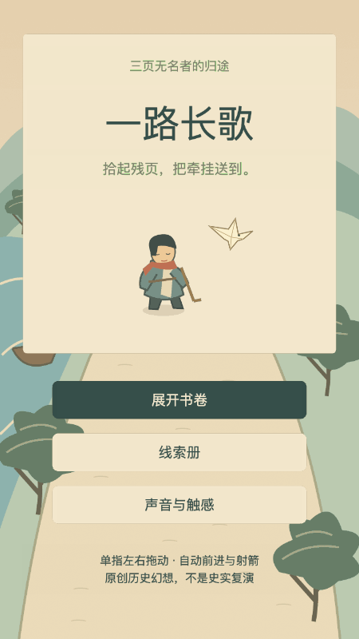

# 一路长歌

**当前状态：首版工程基线，用户不认可现有界面、故事与文案，等待重做评审。** 技术测试通过不代表体验验收通过。

仓库当前为私有；当前GPT的GitHub连接尚不能读取这个新库，访问条件见 [BLOCKED.md](BLOCKED.md)。

给 GPT 的入口：[单文件评审包](docs/REVIEW_PACKET.md)（汇集截图、故事原稿、实际台词与评审问题）；[简版评审说明](docs/GPT_REVIEW.md)。



国风纸兵冒险，竖屏，战国「渡口送简」→西汉「关道护粮」→唐「长街寻信」。单指空白处左右拖动、自动前进与向前射箭。人数同时决定余量与火力，归零折返，可免费重开。

当前验收以 [分平台验证](docs/VERIFICATION.md)、[PROGRESS.md](PROGRESS.md)、[BLOCKED.md](BLOCKED.md) 与 `evidence` 的真实结果为准。用户已反馈界面、故事和文案不合格；爽感、首次十秒理解及目标手机性能仍需亲验。不得把构建成功写成试玩通过。

## 运行

唯一工程路径：`/Users/yvainair/Code/游戏-左右滑古代史`。

已安装官方 Cocos Creator **3.8.8**：
`/Applications/CocosCreator/Creator/3.8.8/CocosCreator.app`

Node **22.23.1**、npm **10.9.8**；美术重生成用 sharp，音频重生成需 ffmpeg。工程来自本版本自带2D场景模板，场景为 `assets/scenes/Journey.scene`；浏览器和微信都由同一工程引擎构建。

```sh
cd '/Users/yvainair/Code/游戏-左右滑古代史'
npm ci --cache .cache/npm --no-audit --no-fund
npm run typecheck:core
npm test
npm run test:negative
npm run build:web
npm run typecheck
npm run serve
```

本机浏览器试玩：[http://127.0.0.1:43187](http://127.0.0.1:43187)。这个 localhost 地址仅在运行服务的电脑上有效，GPT 和其他电脑不能直接访问。服务只绑定本机；关闭服务后用 `npm run serve` 重启。不能直接双击HTML，需通过本地HTTP加载引擎资源。

```sh
npm run build:wechat
npm run test:edge
npm run test:browser
npm run test:failure
```

- `build:web` 与 `build:wechat` 实际调用 CocosCreator `--project <本工程> --build "configPath=<配置JSON>"`；官方退出码36代表构建成功，脚本转换为shell退出0。详细命令及编辑器原始退出码写入 `evidence/build-*-result.json`。
- `test:negative` 在 `.cache/negative-gate` 复制临时测试夹具，去除门一次结算保护，以正式同条断言验证失败；删除故障夹具，校验正式源码未改变。不会把预期失败伪装为正常测试成功。
- `test:browser` 用Playwright启动本机Chrome、通过真实指针输入连续玩10局；不调用跳时间、强制胜利或直接解锁接口。约需13分钟；运行时保持测试浏览器可见，不另操作它。测试profile与证据在本工程内。
- `test:edge` 测试手机比例触控、存储与后台流程；`test:failure` 通过真实输入走失败路线，检查免费重开和失败线索保留。三个浏览器测试顺序运行，避免窗口焦点互相影响。
- `.npmrc` 与 `tools/run-local.mjs` 把后续验证的npm缓存、TMPDIR/TMP/TEMP固定在工程内。早期工具默认临时目录偏差见 BLOCKED.md。
- 编辑器首次构建生成 `temp/tsconfig.cocos.json` 后才可运行Cocos类型检查。strict检查项目源码；官方SDK内部声明缺失通过skipLibCheck隔离，规则验收不跳过。

微信目录：`build/wechatgame`。其AppID明确为游客占位 `touristappid`，**不是合法身份、不是已验收微信包，也不能上传**。当前开发者工具对此返回code10，需本人的专用小游戏AppID和权限后再构建/打开；不使用Cocos自动回填示例AppID或任何业务小程序AppID。未发布。

## 源码与资料

- `assets/scripts/core`：规则、关卡和存档；`Game.ts`：Cocos画面界面；`Platform.ts`：平台适配。
- `art-source/*.svg`：全部可编辑原创素材；`assets/resources/art`：运行PNG；`assets/resources/audio`：原创轻音乐和动作MP3，WAV原稿位于 `art-source/audio`。
- `tools/art.mjs`、`tools/audio.py`：素材可复现生成源；`npm run art` 重生成本任务原创资产。`tools/visual-drafts.mjs` 生成三关视觉稿。
- `docs/visual/level-1.png`、`level-2.png`、`level-3.png`：三关视觉稿，SVG源同目录。
- [人物与三关短脚本](docs/STORY.md)、[史料底稿](docs/HISTORY-SOURCES.md)、[十二章总纲](docs/TWELVE-CHAPTERS.md)、[实现边界](docs/ARCHITECTURE.md)、[冻结验收基线](docs/ACCEPTANCE.md)。
- `evidence`：命令日志、实测快照与截图；失败记录不会拿来替代通过结果。

## 工具来源

- [Cocos官方下载页](https://www.cocos.com/creator-download)，正式包版本3.8.8，121518构建。
- [官方命令行构建说明](https://docs.cocos.com/creator/3.8/manual/zh/editor/publish/publish-in-command-line.html)。

游戏不含账号、服务端、遥测、广告、内购、体力、装备、商城、每日任务或排行榜；历史链接仅是线索里的文字出处。所有故事、艺术和声音为原创简化版本，具体器物、服饰不冒充考据复原。

## 交付归档

`python3 tools/package-release.py` 在 `release` 内生成源码、浏览器构建、真实微信构建与证据四份ZIP，逐份校验CRC并写入 `manifest.json` 和 `SHA256SUMS`。源码包含原创SVG/WAV、三关视觉稿和十二章总纲，不打包依赖、缓存、编辑器下载包或浏览器profile。

用户亲验入口与操作见 [PLAYTEST.md](docs/PLAYTEST.md)。已有路径审计偏差明确记在 BLOCKED.md，未将其隐藏为“零越界历史”。
