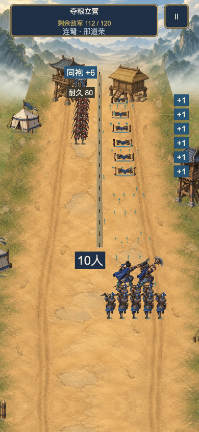
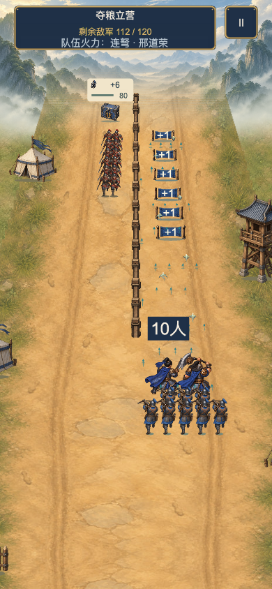
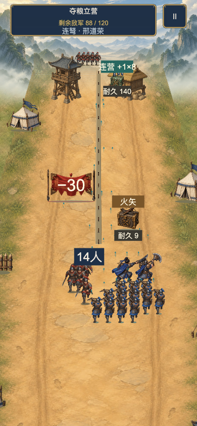
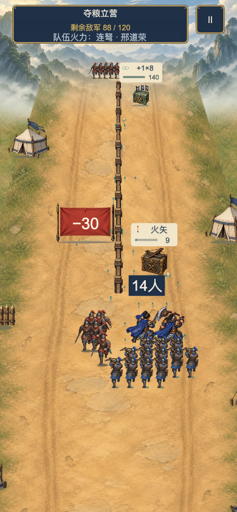
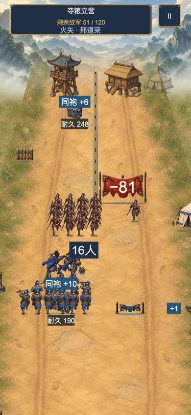
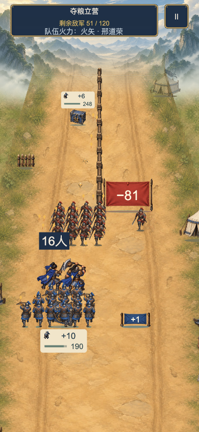
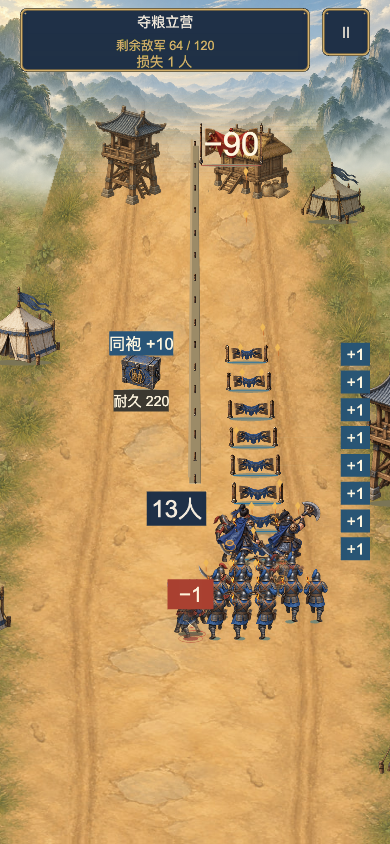
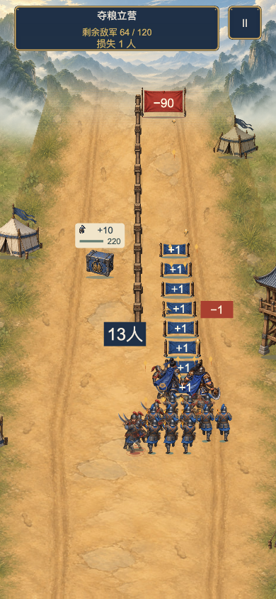

# GitHub 核查入口｜一路长歌：三国 FIX2

本分支从仓库原 `main` 的 v0.5.1 提交起步，收录之后本地累计的游戏代码、美术及 FIX2 证据。因此 PR 差异包含 v0.6 至 FIX2 的累计开发，不能把每个差异都归因于 FIX2。请先读 [本轮最终说明](FINAL_REVIEW.md)、[逐项结果](FIX2_REVIEW_RESULTS.json)、[验收边界](KNOWN_GAPS.md)，再按下面的代码和实物核查。

本分支的 `assets/scripts`、`assets/scenes`、`settings`、`package*.json`、`tsconfig*`、`assets/resources`、`art-source` 和 `music-source` 与本地可运行 FIX2 快照逐文件一致。[BUILD_ID](../../evidence/BATTLE-FIX2-20260925/BUILD_ID.json) 中 `gameSource` 102 项、`art` 270 项的 SHA-256 已在 GitHub 工作树复制后全部重算匹配。构建产物和完整 ZIP 是本地交付物，仓库忽略 `build/` 与 `release/`；本分支不能替代预构建包，也没有重新在 GitHub 主机执行 Cocos 构建。

## 查什么

| 内容 | 代码和证据 |
|---|---|
| 五种兵器动作、真实出弹和波形 | [战场呈现](../../assets/scripts/BattleView.ts)、[动作时序](../../assets/scripts/ui/WeaponPresentation.ts)、[真实发射模型](../../assets/scripts/core/runner.ts)、[10 段原始兵器片](../../evidence/BATTLE-FIX2-20260925/weapon-clips/2026-09-25T17-00-59-090Z/report.json)、[25 秒合辑](../../evidence/BATTLE-FIX2-20260925/weapon-identity-showcase.mp4) |
| 正负零值、连续门和四类箱排版 | [战场和标签](../../assets/scripts/BattleView.ts)、[最终布局复核](../../evidence/BATTLE-FIX2-20260925/layout-recheck-latest.json)、下方实图 |
| 顶部装饰与木墙 | [场景绘制](../../assets/scripts/BattleView.ts)、[8 秒连续原速片](../../evidence/BATTLE-FIX2-20260925/top-decoration-uncut.mp4)、下方墙端实图 |
| 增援门封顶与可击窗口 | [门配置](../../assets/scripts/core/runnerConfig.ts)、[模型](../../assets/scripts/core/runner.ts)、[旧值和依据](CAP_AUDIT.md)、[A/B 数据](CAP_AND_PACING_REPORT.json)、[参数差异](PARAMETER_DIFF.json) |
| 保留三关、菜单与存档 | [现有流程](../../assets/scripts/Game.ts)、[存档](../../assets/scripts/core/save.ts)、[完整自然三关原片](../../evidence/BATTLE-FIX2-20260925/full-natural-three-levels.webm)、[流程记录](../../evidence/BATTLE-FIX2-20260925/natural-flow.json) |

以下是实际 390×844 引擎截图；同一初始状态、触摸输入及时间点，视觉对照显式固定旧 `capped` 策略以隔离美术变化。自然三关录像使用新的 `window` 策略。[全部 12 组状态比较](../../evidence/BATTLE-FIX2-20260925/compare-latest.json)和[四组元数据](../../evidence/BATTLE-FIX2-20260925/COMPARISON_GROUPS.json)可复查。

| 项目 | FIX1 基线 | FIX2 实际画面 |
|---|---|---|
| 武将攻击 |  |  |
| 门箱布局 |  |  |
| 木墙端点 |  |  |
| 连续门接敌 |  |  |

本地验证：84 项相关检查通过；旧 39 通过、3 失败的布局问题保留记录，随后 27 项修复复核通过；12 组同态、36 组可读窗口、五兵器 10 段实录通过；一次完整自然三关通过，时长约 36/52/56 秒，结束兵力 607/11/121。原 38 秒[展示短片](../../evidence/BATTLE-FIX2-20260925/showcase.mp4)取自自然原片，切点见 [CLIPS](../../evidence/BATTLE-FIX2-20260925/CLIPS.json)。本地完整开发包还通过独立 ZIP 解包启动及逐文件校验，见[回执](../../evidence/BATTLE-FIX2-20260925/PACKAGE_VERIFICATION.json)。

旧正值上限 `4/8/12`、缺省 `64` 及人数 `256` 是旧工程初值，不代表已证实的原版公式。15 个普通门现显式采用 `window`，真实累计伤害到阈值后继续改值；有意保留一次领取与错过不补偿。实体手机的触控、胶囊、听感、后台与持续性能，以及用户审美认可仍待核验。拥挤时人数牌与己方关联偏弱也已记录。[浏览器核验细节](../../evidence/BATTLE-FIX2-20260925/REVIEW_RESULTS.md)区分了这些边界。

请在此 PR 讨论中给出逐项核查结论和可复现问题，引用文件、场景与证据。不要把测试通过直接写成手机或审美验收通过；也不要把缺失的原版公式补成声称完全还原的参数。
