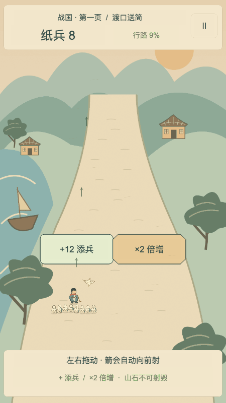
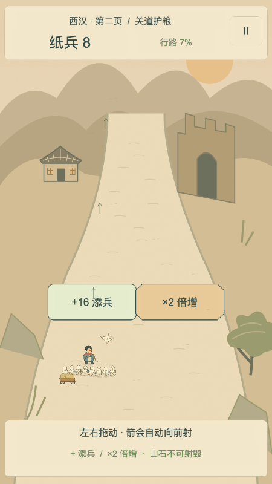
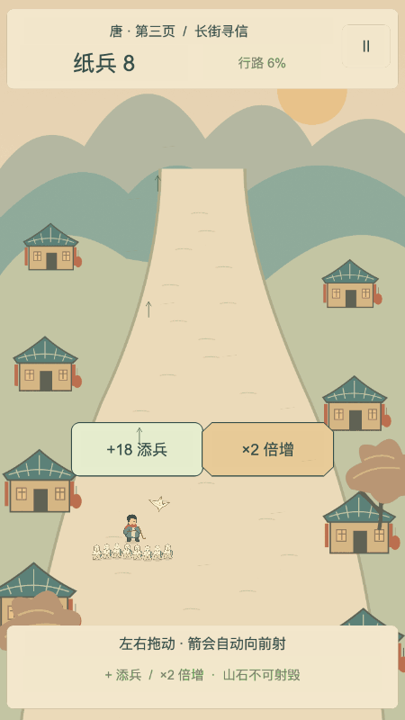
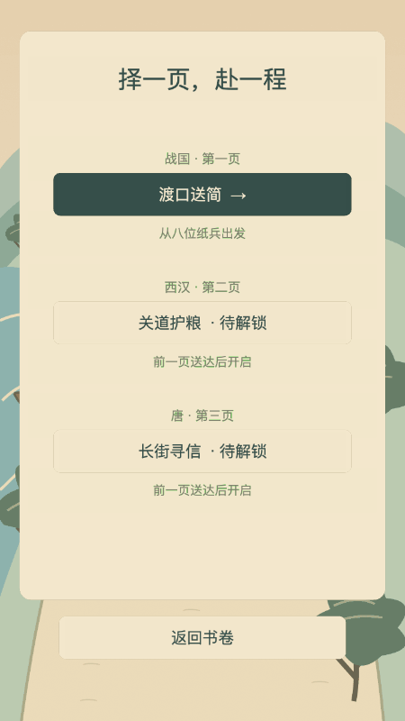
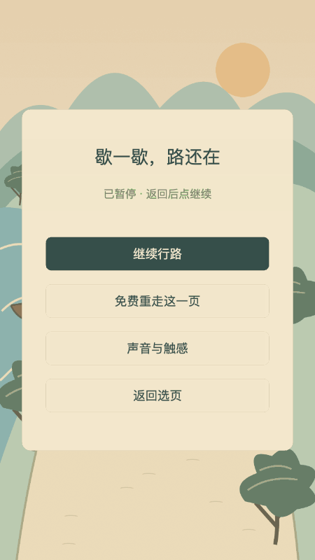
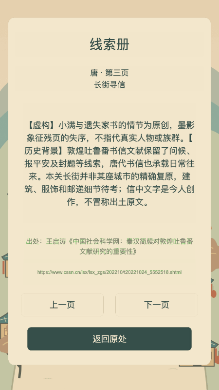

# 一路长歌 · GPT 单文件评审包

当前是被用户否定界面、剧情和文案的工程基线。以下汇集评审说明、当前故事和实际关卡文案，方便一次读取；源码与截图仍以仓库对应文件为准。

# 给 GPT 的评审说明：一路长歌

## 当前需求

用户实际反馈：**「界面太丑了，故事情节不好，文案也不对。」**

这是待重做的首版工程基线。技术测试通过不代表好看、好玩或故事成立。本轮先请你审阅并给出有取舍的改进建议，不直接实现，不替用户宣布验收通过。

## 游戏为什么做

用户喜欢单指左右滑动、射击、选数字门增兵的游戏，想做出自己愿意反复玩的作品。未来能盈利更好，本轮不以变现为目标。

已经确认的方向：国风绘本、竖屏、纸兵、逐朝冒险、战国/西汉/唐三关、Cocos Creator 3.8.8。优先级是规则正确与操作公平顺畅，其次核心玩法，再是美术细节。不要建议改成别的引擎、网页壳，或加入广告、付费、体力、排行榜。

玩法是：8兵出发，左右拖动，自动前进射箭；横向位置决定射击通道；选固定+N或×2门；清木栅、绕山石、躲墨影预告；守关停步，射击并横移躲攻击，击破后结算；归零免费重开。真实人数上限256，可见最多48。

三页当前主题：战国「渡口送简」、西汉「关道护粮」、唐「长街寻信」，帮助普通人送竹简、送粮车、找家书。纸兵来自残缺史书的幻想力量，不表示战国普及纸张。敌人是失序墨影，不把历史真人或族群写成反派。粮车没有独立血条。翻页明确跨时代。

## 先看实际画面

以下为当前 Cocos 构建的真实截图，不是未来效果图：

|首页|战国战斗|西汉战斗|唐战斗|
|---|---|---|---|
|||||

|选关|暂停|结算|线索|
|---|---|---|---|
|||||

图片若无法加载，请明确说没有看见，不凭路径描述画面；可先审阅文字和代码。截图不能替代动态操作体验，本机 localhost 地址不能从云端访问。

## 建议阅读顺序

新增历史参考：[课程原创学习稿说明](../references/chinese-history/README.md)、[课程目录](../references/chinese-history/INDEX.md)、[课程材料与创意任务指南](../references/chinese-history/GPT_GUIDE.md)。共 326 篇逐讲稿、12 份时期综述；8 条目录缺稿。请在了解游戏目标后按需选读，区分课程观点、独立史料和游戏虚构。首关战国材料仍需补证。

1. 本页：用户目标、反馈、截图及问题。
2. [人物与三关故事](STORY.md)、[实际游戏台词与关卡配置](../assets/scripts/core/levels.ts)。台词最终以代码为准。
3. [十二章总纲](TWELVE-CHAPTERS.md)、[史料与虚构边界](HISTORY-SOURCES.md)。首版只开放三关，其他章节只作文字规划。
4. [Cocos界面实现](../assets/scripts/Game.ts)、[原创美术生成源](../tools/art.mjs)、[素材源目录](../art-source)。当前画面由原创简化SVG/PNG、Cocos Sprite/Graphics/Label构成，没有网页CSS层。
5. [规则实现](../assets/scripts/core/model.ts)、[测试](../tests/rules.test.ts)、[冻结验收要求](ACCEPTANCE.md)。建议不能靠降低这些标准落地。
6. [验证报告](VERIFICATION.md)、[未完成与偏差](../BLOCKED.md)。桌面十局记录不是微信真机或用户体验验收。

## 请回答这些问题

### 1. 先作诊断

分别指出界面、美术、叙事、文案里最影响体验的具体问题，引用实际截图元素或原句。把观察、推断和仍需试玩验证的事情分开。不要只说「增强沉浸感」「提高国风感」或列通用设计词。

可以从以下角度查证，但不要把它们当成已经成立的结论：人物与兵阵是否过小；主次与留白是否合适；数字门是否像网页按钮；背景是否撑得起绘本气质；故事是否只是不同朝代换名送东西；情绪是否主要靠口号，而缺少人物行动与变化；UI是否混用了工程提示和角色对白。

### 2. 给出两种有区别的改进方向

在已确认的国风绘本、竖屏、纸兵、三关和引擎约束内，给两种具体的视觉与叙事方向。分别说明人物比例、线条/材质、构图、道路层次、战斗信息层级、UI样式、故事语气及制作成本。选出你更推荐的一种并说明代价，不擅自宣称用户已经选择。

### 3. 重写一关作为可审查样稿

先为「渡口送简」提出人物愿望、遇到的具体困难、玩家行动如何推动故事、结尾发生的变化。给出最多两句可跳过开场、一句结算，以及100–180字可选线索。战斗不暂停读文，不弹历史题。明确虚构与史料；不编造引用。再说明汉、唐两关如何产生不同的情境与行动，而非只换名字。

### 4. 给一张文案替换表

按「页面/当前原文/问题/建议替换/理由」列出首页、选关、出发提示、战斗反馈、暂停、失败、胜利、翻页、线索入口的关键文案。保持中文自然、短、可直接理解；不要用大量诗句掩盖操作信息，也不要把测试或技术说明塞进游戏流程。

### 5. 排出能执行的重做顺序

区分必须先改、第二轮改、可保留，指出对应文件、需新绘制的资产与用户亲验项目。给出第一轮可以看图比较的具体交付物。保留规则、测试及平台边界；如果某建议会影响已冻结规则，先单列冲突，不偷偷改验收。

## 给用户复制到 GPT 的短提示

> 请先读这个仓库的 docs/GPT_REVIEW.md，并实际查看其中截图、STORY.md 和 assets/scripts/core/levels.ts。用户认为当前界面太丑、故事情节不好、文案不对。请按评审说明输出具体诊断、两个视觉叙事方向、一关重写样稿、文案替换表和重做优先级。不要因为技术测试通过就评价成品合格；没读到或没看见的内容请明确说明。先给建议，不直接改代码。


---
# 当前人物与三关故事（原稿，待重写）

# 一路长歌 · 人物与三页脚本

## 世界与人物
旅人「行知」没有朝代身份，是修补残缺史书的读者化身。青灰短袍、赭红围巾、竹色行杖是原创识别元素，不声称复原某朝服饰。脸部用温和闭弧眼、微笑与偏圆轮廓，动作轻、步幅短；抵达时不作征服姿态。愿望是把书中未说完的一句话送到。

纸雀「阿折」从史书缺角醒来，翅膀保留折线，以小幅上下摆动带路。它提醒操作，不在战斗中考问历史。纸兵是残书幻想之力，折痕、米白纸身、青色弓；兵力是同行力量与生命余量，不对应某朝真实军制，也不表示战国已有普及的纸张。

敌人全是「失序墨影」：墨团涌动、暖金裂纹，无真人、族群或政权对应。守关击破是把墨迹重新理顺。史料和幻想在可选线索里明确区分。

## 三关剧本
可执行文本以 `assets/scripts/core/levels.ts` 为单一内容源。开局各2句，可跳；战斗无读文暂停、历史题或配音长过场。半程拾得线索，即刻本地保存，失败仍保留。结算显示必看的一句，继续按钮同时可用，不用计时强制停留。

### 战国 · 渡口送简
人物愿望：阿禾想让对岸的阿兄知道家里在等。
行动：带竹简过渡口，拾拢纸兵，射开木栅、绕开山石，把信物交到对岸。
开场：①渡口的阿禾：这一束竹简，能捎给对岸的阿兄吗？②纸雀：手指左右拖，纸兵会跟着你，箭会自己往前飞。
结算：竹简送到了，渡口多留了一盏等人回家的灯。
视觉：青绿层山、浅水、帆舟、低矮屋舍；路面在斜俯视景深中清晰留白。具体船形与衣饰为待考艺术设定。

### 西汉 · 关道护粮
人物愿望：炊人阿麦想让走了远路的人吃上热饭。
行动：跟随粮车穿过关道；粮车只是伴行视觉，无独立血条、碰撞逻辑或失败条件。
开场：①炊人阿麦：粮到了，灶上的水才不算白烧。②纸雀：翻过数百年，这次走西汉关道；先射开木栅，再选门。
结算：粮车停在灶边，远行的人终于赶上了一顿热饭。
视觉：土黄山岭、夯土关门、干草、粮袋与木车，减少水与浓绿。具体车轴、关墙构造待考。

### 唐 · 长街寻信
人物愿望：补衣人小满想告诉远行的人，有人仍在等他。
行动：在街巷找回家书，穿行多组门与墨影预告，将牵挂归还。
开场：①补衣人小满：信还没到，他会不会以为家里没人等？②纸雀：又翻过数百年，已是唐时；替无名的人，把牵挂找回来。
结算：家书里没有壮阔功业，只有一句：饭还热着，等你。
视觉：成列屋舍、青瓦赭柱、暖色小灯与秋树；并非真实唐代城市平面或建筑复原，装饰细部待考。

## 跨时代翻页
「翻页，跨过时光」＋「战国 → 西汉」或「西汉 → 唐」。明确说明：两页之间已过去数百年，这不是连续旅程，而是不同年代相似的牵挂。通关时立即解锁，跳过翻页说明和线索阅读不影响进度。

## 美术与音频权属
本项目 SVG 路径、人物、场景、纹理、旋律与合成音效均为本任务原创简化美术。源代码在 `tools/art.mjs`、`tools/audio.py`，矢量与WAV源在 `art-source`，运行纹理与音频在 `assets/resources`。未采购、复制或引用商业游戏资产。尚未把「绘本气质」标为用户验收通过。


---
# 实际关卡配置及对白

以下直接来自 assets/scripts/core/levels.ts，未另行美化原文。

```typescript
import { Level, Row, Obstacle } from './model';
const add = (value: number) => ({kind:'add' as const, value});
const double = {kind:'double' as const, value:2};
const row = (id:number, at:number, n:number, reverse=false):Row => ({id,at,left:reverse?double:add(n),right:reverse?add(n):double});
const obstacle = (id:number,at:number,x:number,kind:Obstacle['kind'],hp:number,loss:number,width=.29):Obstacle => ({id,at,x,kind,hp,loss,width});
export const LEVELS:Level[] = [
 {id:0,title:'渡口送简',era:'战国 · 第一页',duration:46,start:8,bossHP:1100,bossLoss:7,
 rows:[row(1,6,12),row(2,15,18,true),row(3,26,26),row(4,37,34,true)],
 obstacles:[obstacle(1,12,.48,'wood',22,12),obstacle(2,21,-.48,'rock',999,10),obstacle(3,25,.48,'wood',35,16),obstacle(4,32,-.48,'ink',1,9),obstacle(5,40,.48,'rock',999,14)],
 intro:['渡口的阿禾：这一束竹简，能捎给对岸的阿兄吗？','纸雀：手指左右拖，纸兵会跟着你，箭会自己往前飞。'],
 ending:'竹简送到了，渡口多留了一盏等人回家的灯。',
 clue:'【虚构】阿禾托你送竹简，纸雀和纸兵都来自残缺史书的幻想力量，并非战国纸张已普遍使用的证据。【历史背景】战国楚地已有竹简书写，存世竹书保存了思想与典籍材料。本关借“送简”讲牵挂，不复原某次真实递送；渡口位置、人物衣饰与竹简所写内容均为艺术设定，具体形制待考。',
 source:'清华大学《千年竹简与百年清华的相遇》',url:'https://www.tsinghua.edu.cn/info/2035/70732.htm'},
 {id:1,title:'关道护粮',era:'西汉 · 第二页',duration:60,start:8,bossHP:1900,bossLoss:11,
 rows:[row(1,6,16),row(2,17,22,true),row(3,29,30),row(4,41,36,true),row(5,52,44)],
 obstacles:[obstacle(1,13,.48,'wood',30,16),obstacle(2,23,-.48,'rock',999,18),obstacle(3,28,.48,'wood',55,25),obstacle(4,35,.48,'ink',1,14),obstacle(5,40,-.48,'wood',64,22),obstacle(6,47,-.48,'rock',999,20),obstacle(7,55,.48,'ink',1,16)],
 intro:['炊人阿麦：粮到了，灶上的水才不算白烧。','纸雀：翻过数百年，这次走西汉关道；先射开木栅，再选门。'],
 ending:'粮车停在灶边，远行的人终于赶上了一顿热饭。',
 clue:'【虚构】阿麦、粮车和护送之旅是原创故事；粮车只承载叙事，没有独立血条。【历史背景】悬泉置汉简留下驿置接待、粮食出入与日常事务的记录，让宏大交通网络背后的吃饭与劳作可被看见。本关借此想象关道上的一顿饭，并非复原某条运输路线；车辆、服饰和关门细部仍属待考的简化美术。',
 source:'甘肃文博会《悬泉置：驿站小人物与历史大事件》',url:'https://www.gswbj.gov.cn/a/2019/11/01/3487.html'},
 {id:2,title:'长街寻信',era:'唐 · 第三页',duration:74,start:8,bossHP:2000,bossLoss:15,
 rows:[row(1,6,18),row(2,18,24,true),row(3,31,32),row(4,44,42,true),row(5,57,50),row(6,67,56,true)],
 obstacles:[obstacle(1,14,.48,'wood',36,20),obstacle(2,24,-.48,'ink',1,15),obstacle(3,30,.48,'wood',70,27),obstacle(4,38,-.48,'rock',999,25),obstacle(5,43,-.48,'wood',85,28),obstacle(6,50,.48,'ink',1,20),obstacle(7,56,.48,'wood',100,32),obstacle(8,63,-.48,'rock',999,28),obstacle(9,70,.48,'ink',1,22)],
 intro:['补衣人小满：信还没到，他会不会以为家里没人等？','纸雀：又翻过数百年，已是唐时；替无名的人，把牵挂找回来。'],
 ending:'家书里没有壮阔功业，只有一句：饭还热着，等你。',
 clue:'【虚构】小满与遗失家书的情节为原创，墨影象征残页的失序，不指代真实人物或族群。【历史背景】敦煌吐鲁番书信文献保留了问候、报平安及封题等线索，唐代书信也承载日常往来。本关长街并非某座城市的精确复原，建筑、服饰和邮递细节待考；信中文字是今人创作，不冒称出土原文。',
 source:'王启涛《中国社会科学网：秦汉简牍对敦煌吐鲁番文献研究的重要性》',url:'https://www.cssn.cn/lsx/lsx_zgs/202210/t20221024_5552518.shtml'}
];

```


---
# 当前关键界面文案

以下摘自 assets/scripts/Game.ts，保留原措辞供评审。完整动态文案以源文件为准。

|位置|当前原文|
|---|---|
|首页副题|三页无名者的归途|
|首页标语|拾起残页，把牵挂送到。|
|首页主按钮|展开书卷|
|选关标题|择一页，赴一程|
|开场主按钮|跳过对白 · 出发|
|操作说明|空白处左右拖动，箭沿你的位置飞出|
|行路提醒|提前选路，箭沿队伍中心飞出|
|守关提醒|对准墨影射箭，落墨前横移|
|暂停标题|歇一歇，路还在|
|暂停重开|免费重走这一页|
|失败标题|纸散了，心意还在|
|失败说明|只因纸兵归零折返 · 没有倒计时惩罚|
|胜利标题|此页，已送达|
|翻页标题|翻页，跨过时光|
|翻页主按钮|不读也能继续 · 下一页|
|线索入口|读这一页的线索|
|最后一页主按钮|合上三页 · 回到书卷|


---
# 阅读限制

本包不是“GPT已评审”的结果。若你无法读取仓库图片，请明确这一限制。技术证据在 docs/VERIFICATION.md；用户明确否定当前视觉、故事和文案，不得据技术通过推翻这一反馈。需要动态手感结论时先提出可验证的试玩问题，不假称已经亲自玩过。
