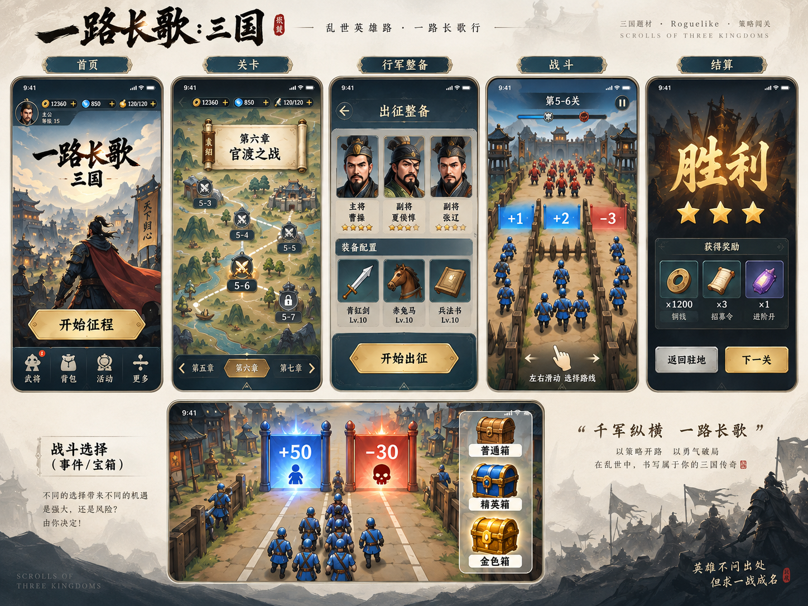

# 《一路长歌：三国》界面重构开发文档

任务 UI-20260925 · 文档1.0 · 2026-09-25

交付状态：开发规格与参考资料；游戏尚未在本次会话中修改。

> 图中额外系统不自动成为需求，按第2章的明确映射执行。

## 01｜交付目标与执行边界

把已经认可的画面，落到现有可玩的游戏里。

任务编号 UI-20260925，文档版本 1.0。此编号只用于本轮界面重构，不代表游戏已经升级或通过验收。基线为 Codex 当前本地最新累积工作区；v0.9 入口仅是已知参考。

主要依据：用户本轮选中的四张截图与随后确认的五屏界面展示图。采用其三国手绘城寨、地图卷轴、墨蓝面板、旧金按钮、主将披风、蓝正红负门和战后仪式感。资料索引见第20章及 sources/。

|交付对象|本轮必须实现|
|---|---|
|五个核心页面|首页、关卡地图、行军整备、真实战斗、胜利/失败结算。|
|完整流程|驻地、关间过渡、会面、暂停、设置、加载和错误态使用同一套视觉组件。|
|工程成果|接入真实状态的可运行构建、资源清单、同状态前后截图、自然三关录像、待验说明。|
|本包提供|文字规格、参考图、参数、资源生产合同、视图数据接口及验收案例。未提供已制作完成的运行美术或已修改的游戏代码。|

### 两类信息分开处理

参考图负责外观方向；现有游戏状态负责人物身份、兵器、奖励、关卡和胜负。图中演示数值和额外系统不得直接写进游戏。本轮新增尺寸、时长、文件名和接口均为实施提案，Codex 需在真实屏幕验证。

保留连续三关、单跑道自由横移、射击改值门、箱子耐久与奖励分离、多成员出弹、连续+1、占位风险、永久解锁与存档。音乐仍关闭。来源：S1「交付与边界」、S2「不动的产品骨架」。

## 02｜把参考图映射到真实功能

保留画面完成度，同时消除示意内容与游戏逻辑的冲突。

|参考图中的元素|本轮执行决定|
|---|---|
|披风主将、远景城寨|采用主视觉构图；身份仍用当前主角。允许背身或侧背展示，更新旧稿“避免背对”的限制。|
|地图卷轴、第六章、5-6|保留卷轴和曲线路径；只绘制实际三关及真实名称，删除虚构章节页签。|
|金币、钻石、体力、充值加号|无已实现并确认的数据就不显示；改为当前身份、征程与关卡进度。|
|曹操、夏侯惇、张辽及三人上阵|卡片样式采用；不替换当前主角，不扩成双副将系统，选择人数受真实配置约束。|
|马匹、兵法、Lv.10、星级|不新增这些系统；用现有兵器与同袍卡填充真实信息。|
|普通箱/精英箱/金色箱侧栏|借用木、金属、金色材质层次；不新增固定宝箱侧栏或稀有度规则，展示真实奖励类型。|
|三条封闭道路、滑动选择路线|采用远近层次、路缘和栅栏材质；下方仍自由横移，只保留现有关卡真实挡弹结构。|
|滑动发动技能|不采用；教学文案为“左右拖动，调整火力方向”，无新增技能按钮。|
|胜利三颗星、1200/3/1奖励|保留大字、光晕、奖励卡与双按钮构图；无星级规则时不显示评级星，实际无奖励则显示战果。|
|手机状态栏、刘海、设备外框|均属展示图外壳，禁止画入运行界面。|

以上是本轮明确的落地取舍，不代表用户逐项批准了示意图里的所有系统。若本地版本已合法新增某项，先写入 REALITY_MAP 并说明与旧基线的差异，禁止默默覆盖。

## 03｜统一视觉与尺寸规则

美术、排版和交互共用一套标准，页面分别承担自己的任务。

|项目|执行规格（设计初值）|
|---|---|
|基准画布|竖屏，390×844逻辑单位。背景可出血；所有交互布局使用转换后的安全矩形。|
|颜色|墨蓝 #1E2F46；深底 #142432；旧金 #D4B06A；米白 #F4EBDC；正门 #2A94D6；负门 #C94537。|
|字体|书法仅用于品牌字标、胜败标题；正文与实时数字使用可读字体。正文16、辅助14、页标题24、门值32—40。|
|按钮|主要按钮高56、宽按容器伸展；次按钮高48；所有可点热区至少48×48。主按钮金底墨色字。|
|间距|页面左右20；卡片间12；组间20—24；面板内16；图标视觉24—28，热区保持48。|
|面板|墨蓝或低噪声米白底，细金属边。背景复杂时增加实色衬底，禁止多层半透明叠字。|
|动效|按压80—120ms；普通切页180—240ms；大演出最长约900ms且可跳过。游戏状态不等动画结束。|

### 组件应包含状态

金色主按钮、灰蓝次按钮、返回按钮、武将卡、兵器卡、地图节点、奖励卡、门值标签、提示条、通用弹窗。分别覆盖默认、按下、选中、锁定、禁用、忙碌及错误；按组件实际职责采用，不能只完成静态正常态。

### 短屏与长文案

页头和底部操作区固定可达，中部内容可滚动。先减少装饰空白与角色展示高度，再增加滚动；不把所有文字整体缩小。固定高度仅用于按钮等小组件，长文本、奖励区与空态使用内容驱动。

完整参数见 config/design_tokens.json。数值属于本次提案，变更后需同步记录，不能被描述为竞品原版参数。

## 04｜首页：主将、目标、开始

进入后先感受到场景，再立即知道怎样继续。

参考裁片：`references/crops/home.png`（概念外观，非游戏实测）。

目标参考为首页裁片。城寨远景淡、主将中近景清楚、金色主按钮突出；旧稿的小展示台首页由这版全幅主视觉替代。

|区域|布局与真实内容|
|---|---|
|顶部约0—12%|当前主角的小头像、真实身份或征程信息；设置放在平台胶囊避让后的可点击位置。无货币栏。|
|上中部约12—35%|独立《一路长歌：三国》字标。标题背景留白，建筑屋脊、旗杆不穿过字。|
|中部约28—75%|一个主将及分层城寨；主将脸部/剪影/兵器不被按钮遮住。背景中不得再烘焙第二个同角色。|
|底部动作区|本次目标短句＋一个主动作，下方仅关卡、整备、驻地/设置等真实入口。|

百分比为安全内容区内的构图参考，不是五个相互独立的固定块；交叠只允许发生在背景与主视觉。底部实际高度由主按钮、导航和安全区共同决定。

### 按钮与状态

新存档：开始征程。已有可恢复征程：继续征程。尚欠整军/插旗等过渡：继续整军或继续建营。三关完成：返回驻地。按钮必须调用现有流程解析，禁止仅按文案硬跳下一关。

任一主动作首次按下即进入忙碌态，防止重复开启战斗；失败恢复按钮并给出可处理原因。首页导航不触发战斗，也不清空存档。

验收：标题、人物、金按钮在实际手机尺寸下都清楚；只有一个主将；没有虚构资源或红点；新存档与继续流程可分别完成。

## 05｜关卡：把三关放进一张地图

地图承担位置感，节点承担可操作的信息。

参考裁片：`references/crops/chapters.png`（概念外观，非游戏实测）。

采用参考中的手绘山河、卷轴题头、曲线连接与当前节点金色高亮；地图为场景，节点、路径进度、文字和锁定标志单独渲染。

|对象|实现要求|
|---|---|
|卷轴题头|显示实际篇章/征程名称，无现成篇章就写“三国征程”；不得固定写“官渡之战”。|
|三关节点|取实际配置的三个关卡ID、名称、解锁状态；大致沿左下—中部—右上的路径错落分布，初始默认聚焦当前关。|
|当前节点|金边/小旗、清晰标题、可点状态；已完成节点带完成标记；锁定节点带条件短句。|
|详情面板|点击节点后显示关名、已有目标、当前模式最佳成绩和“出征/再战”按钮。|
|安全与导航|返回始终可达；短屏地图内容缩放到可读后仍不足则轻滚动，不挤压节点。|

### 数据与行为

节点点击只选择并展开详情，不在抬手时突然开战。主按钮调用现有关卡启动流程；被锁定时解释已有解锁条件。最优成绩显示当前玩法对应值，不混入旧模式best；无成绩显示“尚未挑战”。

当用户刚完成某关，地图进度先来自已保存结果，再播放一次短点亮。重复进出不重复发奖励、不再次招募。保存失败时保留实际可恢复状态与重试提示。

验收：恰好三个真实节点；当前关一眼可见；已完成/当前/锁定三态不只依赖颜色；节点不藏在山脉和卷轴下面。

## 06｜行军整备：看得清，也选得准

采用肖像卡与装备卡的规整布局，不引入新的养成系统。

参考裁片：`references/crops/loadout.png`（概念外观，非游戏实测）。

页面为页头、当前出征组合、同袍选择、兵器选择、底部操作。参考图的卡片边框、肖像比例和金色按钮采用；人物身份及可选数量以本地真实配置为准。

|区域|内容与状态|
|---|---|
|页头|返回＋“出征整备”。标题独占净色区域。|
|出征组合|当前主将一张主卡＋当前同袍一张卡；没有同袍时显示空位说明，不复制主将。|
|同袍选择|从实际已解锁/未解锁列表绘制。选中显示金边和勾；锁定显示真实条件，不画无效获取按钮。|
|兵器选择|显示现有主将兵器卡。名字、图标与选择一致；不伪造等级、战力、马匹与兵法。|
|本局说明|简短说明途中火力与出征兵器的关系；未实现的属性不显示。|
|底部|返回为弱动作；金色主动作采用明确的开始/继续文案，中心选择区可滚动。|

### 交互合同

点卡片只改变选择并延续已有自动保存。主按钮属于明确的新导航动作：选择合法、保存状态可处理且无待完成过渡时，复用已有开战命令；有过渡则文案与目的地都改为继续过渡。保留原返回路径，不能将“返回”按钮悄悄改成开战。

保存失败显示“选择未保存，重试”；不显示成功对勾。点击锁定项不覆盖当前有效选择。进入时从真实存档恢复，战地临时援手不覆盖永久同袍选择。

验收：头像、名字、武器与实际开局一致；连续切换无第二个主将残影；选中与未选中区别清楚；没有星级、Lv.10等占位数据。

## 07｜战斗画面：纵深、火力与自由横移

战斗的目标观感和真实玩法一起保留。

参考裁片：`references/crops/battle.png`（概念外观，非游戏实测）。

优先沿用现有Cocos渲染路径，以贴图、投影、队形、光影和层次接近参考。此轮不默认升级引擎、不重写为完整3D游戏。现有2D结构是否足够由一次真实场景样片判断。

|画面层|执行要求|
|---|---|
|顶部HUD|关卡短名、任务/进度、暂停；HUD总高初值64逻辑单位，避开刘海与微信胶囊。敌将出现再加真实血条。|
|远景|城门、山脉、敌军入口形成方向感。远处对比降低，不用大牌匾压住战斗。|
|中景|至多突出前方2—3组关键目标；门、箱、敌军各有轮廓，数值与背景分离。|
|近景|蓝色小队、主将、同袍清晰。兵力标签贴近队伍上方，避开门值；不固定挤进角落。|
|下方操作区|可自由横移；不画贯穿全屏的三条封闭路。手势提示仅首次短暂出现。|

### 统一投影，禁止只改外观位置

保留世界坐标和战斗计算。角色脚点、门底、箱底、障碍、弹道、命中特效和调试判定轮廓经过同一套坐标映射；输入用同一映射的反向关系。任何修改透视、缩放或阵型的工作都要证明可见占位与判定一致。

第二关仅画实际挡弹结构；下方开口明显。普通装饰栅栏放在可达区域外，不能看起来堵住一条实际可通行的路。目标的出现时刻与可射击窗口保持基线，变化单独记账。

验收：实际运行中看得出远近关系；左右拖动仍在同一跑道连续移动；不靠假弹幕、删敌或缩血来获得画面整齐。

## 08｜数值门、奖励箱与连续+1

造型负责识别，数值和奖励始终来自模型。

参考裁片：`references/crops/gates.png`（概念外观，非游戏实测）。

|对象|外观与动态规则|
|---|---|
|正负门|木架/旗门＋蓝或红半透明旗面＋清楚的正负号和数字；柱脚、阴影、触碰范围对应。0用中性色。|
|命中改值|只在真实值改变时更新数值；普通命中可亮边。负转正由模型事件触发一次翻色，不把受击闪光做成全门换金色。|
|封顶与领取|达到真实上限才提示“已满”；接触才结算的门保持接触发奖，领取一次后退出。|
|奖励箱|四种语义：兵员、武器、连门发生器、战地同袍。材质可复用，但顶部图标、名称及兑现方式必须可辨。|
|耐久与奖励|大字/图标说明所得，小血条或小数值说明剩余耐久。不得让“+6”同时充当血量。|
|击破|短开裂/解体＋图标反馈；击破即得的奖励当帧入账，动画不延迟数值，不重复发奖。|
|连续+1|每一枚门独立接触和领取。可合并音效与短提示，不合并奖励事务，错过的门不自动补领。|

### 具体表现初值

命中亮边约80ms，改值弹性约140ms，负转正约220ms，箱体解体约200ms，奖励图标飞入约350ms，增兵归队约180—300ms。动画可并行，但不得用动画完成事件作为唯一入账依据。

参考侧栏中的木箱、蓝金箱和金箱只作为材质参考。实时战斗不占一列常驻图鉴；本轮不添加普通/精英/金色稀有度抽取规则。

验收：分别验证负门打到0、0打正、封顶、相邻门同时接近、击破箱、连续门部分错过。看得见的奖励与账本相符。

## 09｜角色、动作与战斗反馈

队伍扩大以后，仍应看见一个可以控制的整体。

|对象|实现细节|
|---|---|
|主将/同袍/士兵|沿用真实人物身份；主将轮廓突出、同袍有固定识别位、普通兵简洁。可试1.30/1.15/1.00视觉比例，不能借放大改变实际伤害。|
|队形|依据人数重新成阵；单人、小队、中队、高人数代理都可辨。不铺成横贯跑道的人墙；占位风险仍可见。|
|行军动作|至少明确抬脚落脚、身体重心、兵器与披风变化。禁止把同一静止人像只做上下移动当作完成。|
|出手|从角色实际武器位置发射。已射出的箭不跟随后续拖动转弯；同袍出手有辨识，但不得重复加伤害预算。|
|敌军接近|保留真实追击和接触，减少重叠。清理死亡对象按真实死亡事件，不删除还活着的敌人。|
|损兵|对应接触位置短红闪、实际−N和成员退出；一条损失只播一次反馈。队伍人数与真实值一致。|
|换装|基础弩、连弩、火矢在箭型、尾迹、真实射击节奏与命中反馈上可区分；纯视觉火花不产生新伤害。|
|击杀与敌将|普通兵死亡短而清楚；敌将使用真实HP与状态。击败后清楚收尾，不强制进入近战对决。|

### 素材不充分时的处理

需要动作帧、分层骨骼或等价可控动画。已有动作资源优先复用；只有单张静图就记录待补，不宣称动画已达标。对象池复用时清除旧色、旧血条、旧事件和旧动画进度。

验收片段至少覆盖增兵、减兵、换装、密集出弹、近身受压、敌将结尾。图层整理与减特效可以降载，模型敌数和伤害不能随帧率被偷偷改变。

## 10｜胜利与失败：结果来自这一局

参考中的仪式感保留，奖励与后续动作如实呈现。

参考裁片：`references/crops/result.png`（概念外观，非游戏实测）。

|区域|行为与内容|
|---|---|
|背景舞台|当前战场降亮度或独立战旗场景。胜利暖光、失败冷暗；不叠着首页人物、营地小队与结果肖像。|
|标题|大字“胜利/再次取胜/失利”，一次短演出；有真实解锁才展开奖励。无评级规则不画三颗评级星。|
|结果摘要|实际关卡、完成情况、当前模式成绩及可核实的新纪录；无对应字段的统计不编造。|
|奖励卡|使用金属边框和物件图标，但只显示本局真实新增同袍、身份、解锁等。没有新增则改为战果摘要。|
|主按钮|存在待完成过渡时“整军/建营/驻防”；条件已满足时“下一关”；最终完成时“返回驻地”。|
|次按钮|再战本关或返回关卡，权重低于主按钮；禁止按钮去向与名字相反。|

### 胜败与保存

结算只读取已确定的结果，不通过开界面发奖。胜利/解锁/过渡的写入使用现有幂等路径。重复打开或再次挑战不再次发首次奖励；失败文案读取最后真实损失来源，不用无证据的笼统原因代替。

有保存失败时明确显示“结果未保存”，提供重试并避免下一步掩盖异常。跳过演出仅跳视觉，不跳过写入；动画未结束也不能二次领取。

验收：首胜、重复胜利、真实失败、最终关结束、保存失败五类结果分别核对；结果与账本一致，没有示意图中的虚构铜钱、招募令或进阶丹。

## 11｜驻地、过渡与会面

从出征到落脚，界面应呈现同一场旅程。

|页面|布局及操作|
|---|---|
|驻地|静止营门/帐篷/低噪声地图。显示当前真实进度、主将与继续目标；保留已有整备和关卡入口。|
|关间过渡|用当前已有插旗、整军、建营、驻防动作承接。主视觉只突出当下对象；交互按钮与拖动等价路径都保留。|
|首次同袍加入|一个人物卡或短站位演出，说明真实加入身份；处理一次，完成标志从现有存档读。|
|会面|一至两个人物与短对白框，沿用既有故事。跳过入口清晰，完成记忆不丢失。|
|结束征程|展示三关实际完成与既有落脚地点；不画新的经营资源、天下征伐地图或待开发按钮。|

### 流程顺序

战斗结果确定 → 结算事务/存档 → 展示战果 → 需要时进入已有过渡或会面 → 保存完成标志 → 开放下一段。真实顺序与原模型有差异时，以保持现有正确流程为前提映射，不增设独立奖励入口。

切页时取消当前手势，抬手不能透传点击新页主按钮。新页面允许操作前，旧页面的监听、延迟回调、短提示和特效引用必须清理。

### 场景差异

驻地使用静止生活空间，战斗使用运动跑道，结果使用战后舞台。材质与字形统一，不把三者画成同一条道路上叠三组按钮。地名、卷轴与建筑各自留出位置。

验收：自然完成三关时过渡不丢；中断并恢复不重复招募；会面跳过后不反复弹；二次进入营地不会出现残留敌人或战斗HUD。

## 12｜暂停、设置与异常状态

完整度也体现在玩家需要停下来、退回去或重新尝试时。

|状态|必须明确的行为|
|---|---|
|暂停|冻结战斗模拟、计时和游戏世界动画。弹窗从当前画面升起；继续、设置、返回有清晰层级。|
|继续|恢复前清空旧拖动状态，等待新的按下。不能把暂停前位移一次性补到队伍上。|
|退出战斗|按现有恢复/放弃逻辑说明影响；需要确认时明确告知会丢失什么，不虚称一定可恢复。|
|设置|音效、震动分别控制并保存；音乐无入口或明确不可用且不加载。必要许可与致谢收在次级页。|
|加载|真实进度可测时显示进度；不可测时用不定进度与短说明，不能画虚假的百分比。|
|加载失败|显示具体可理解原因，提供重试与返回；离线游戏资产问题不能统称服务器故障。|
|写入失败|保留可重试结果，提示未保存；重复点击不二次发奖。|
|空态/锁定|无同袍、无记录、未解锁等状态都有短说明；没有实现的功能不画假入口。|

### 可用性底线

弹窗正文换行时不挤出按钮；最小屏幕可滚动正文，按钮固定在安全区内。关闭手势与按钮都不穿透到战场。恢复游戏音效不得叠播暂停期间积压的声音。

可选的界面减动效只作用于界面演出；当前已有震动开关继续有效。音乐保持关闭，音效通过并发与峰值控制避免密集射击刺耳。

验收：连续暂停/设置/继续三次；来电或切后台再回来；加载失败重试；长错误文字；所有状态都能返回可操作流程。

## 13｜美术资产清单与制作责任

图中的完成度需要真正的资源，不能用一张海报铺满屏幕。

|资产组|拆分方式与交付要求|
|---|---|
|首页|无文字城寨背景、远景层、近景层、透明主将、独立字标。人物需可替换，背景中不再包含第二主将。|
|地图|无节点无文字山河底图、卷轴空框、路径、节点四态、当前位置旗帜；地名与关名由程序绘制。|
|角色|现有主将/同袍头像、战斗角色动作资源、脚底阴影；每套角色统一朝向、光照和脚底锚点。|
|组件|金主按钮、蓝灰次按钮、卡片框、空槽、选中/锁定/忙碌态、页头、弹窗。适合伸缩的边框按九宫格等方式制作。|
|战场|可重复道路、两侧栅栏、门柱、帐篷/岩岸/城墙、隔离障碍；素材边界与可见遮挡关系正确。|
|门箱|旗面、正负图标、门柱、四类奖励标识、箱体开裂/击破、连续+1、火花和轨迹。数值不得烘焙。|
|结算|低噪声战旗背景、胜利/失利字标、实奖图标和边框；星级、金币数字不从参考图抠进产品。|

### 本包的资产状态

本包附带的PNG全部是视觉参考，裁片仅用于对照。没有宣称提供已拆分的运行贴图、动画帧或可直接导入的Prefab。config/asset_manifest.json为待生产清单，状态均为待盘点/待制作。

Codex先核对现有可用资源，再列复用、重绘、补帧与替换。可用绘图工具时按美术合同制作；不可用时仍完成布局/接线并输出准确缺口。不得以纯色矩形最终交付，也不得用模糊裁图冒充高清资源。

授权、来源、尺寸、透明边、锚点、切片边距、用途和实际加载去向写入清单。不可复制其他商业游戏的美术资产；不得擅自购买或付费调用。

## 14｜资源生产与接入合同

把整张效果图，转换成可以变化、复用和验证的组件。

|资产类型|制作初值与限制|
|---|---|
|背景|竖版源图建议1170×2532；长图地图可1170×2200。这是源规格，运行输出按实际尺寸与内存预算生成。|
|主将立绘|透明PNG建议900×1400，脚底锚点一致；不含按钮、文字、发光边框和其他角色。|
|头像与物件|头像建议512方形；武器/奖励图标256方形，独立透明边，实画面使用48—112逻辑尺寸。|
|道路与建筑|路面需无接缝，路缘/塔楼可独立遮挡；禁止贴图自带永久敌人、门值或血条。|
|按钮与边框|边角不拉伸，文字独立Label；按下、选中等状态可通过材质/叠层完成。|
|动作资源|尺寸与帧数按实际占屏和性能选；至少行军、出手、受击/死亡的有效变化。没有动画就列缺口。|

### 从资源到实机的顺序

先完成一组风格样片：主页主视觉、一个标准按钮、一小队兵、一个正负门和一段路。放进真实Cocos页面检查缩小后清晰度；通过内部核对后批量生产同风格资源，并继续其他页面，不逐张等待用户审批。

运行资产和参考图分目录；打包产物不得夹带海报和未加载源图。保留原始文件、尺寸、锚点及使用证据；图集、压缩与剔除先盘点后处理。源图分辨率不等于运行纹理分辨率。

美术验收以实际尺寸下的清晰度、人物辨识、统一光照、层次与运行动态为准。AI生成素材仍需人工或程序检查，多余肢体、透视混乱、文字乱码和不透明底不能直接入库。

具体生产提示、负面约束和各项清单见02_ART_ASSETS.md。工具不可用时记录缺口与影响范围，不将素材缺口转为悄悄降低目标。

## 15｜安全区、触控与屏幕适配

设备差异由布局处理，玩家不承担找按钮和躲遮挡的成本。

|问题|实现要求|
|---|---|
|坐标统一|获取的安全矩形、平台胶囊区域和触摸坐标先转换为同一逻辑画布坐标；不要直接混用物理像素、网页像素和设计单位。|
|顶部遮挡|把刘海/状态栏安全区与胶囊实际占位作为约束集合处理，不重复加顶部留白；必要时把暂停挪到第二行。|
|底部手势|主按钮、导航与拖动必要区域在安全矩形内；只有背景允许铺到手势区。|
|拖动|首次按下不跳位；从该点计算相对位移并捕获一根手指，忽略额外触点。按钮区域优先消费事件。|
|取消|触摸取消、切后台、暂停、切页、失焦时清空拖动；返回后必须新按下，不能漂移。|
|短屏|收缩装饰区域和立绘展示高度，滚动中区；正文不缩成小字、底部按钮不出屏。|
|长屏|环境可多显示，战斗有效范围与波次预见窗口保持可比；不得因长屏额外提前触发战斗对象。|

### 验证矩阵

默认检查360×780、375×667、390×844、430×932、768×1024逻辑视口；这些是测试样本，不代表设备真实安全区。至少一个刘海/灵动岛类真机与一个其他实际可用手机确认触控，未有设备的项目明确待验。

安全区与胶囊用实测或平台真实返回值，不按某款手机记忆写死。无数据的浏览器环境使用明确回退，日志记录回退原因。角色、标签、碰撞调试轮廓在所有视口必须重合。

无需新增横屏玩法；横放时延续平台支持策略或提示竖屏，不能裁出半个界面。

## 16｜工程架构与数据接入

画面只表现已有事实；游戏规则只在原来的业务链路里发生。

|层|职责|
|---|---|
|真实模型/存档|人数、伤害、门值、耐久、解锁、胜负与流程。保留现有正确实现。|
|视图适配层|把模型翻译为UI快照和只读事件；明确源字段，缺失用空态，禁止生产环境补假值。|
|页面协调层|负责进入/退出/返回与弹窗栈，保证活跃页面唯一；旧场景清理后再开放输入。|
|共用组件层|按钮、卡片、节点、标签与提示。状态齐全，禁用态同步阻止点击。|
|世界表现层|角色、地景、门箱、弹道和特效，统一坐标与真实事件。|
|资源与平台层|资产按页面加载、引用释放、对象池复用、安全区、输入和设置。|

### 接入前必须完成的映射

Codex读取本地AGENTS、进度记录、入口与适用证据。输出REALITY_MAP：页面入口→真实文件；每个UI字段→模型来源；每个按钮→原业务命令；每项资源→现有/缺失；未提交改动→保护范围。源码路径未核对前，不按本包建议名字假装已有文件。

### 生命周期与事件

enter订阅并加载；render只读；exit取消监听、计时器、异步回调和输入；异步加载返回时核对页面代次。事件去重键含runId及事件ID，页面缓存不能让旧局特效落到新局。对象池按生命周期归还。

新接口见contracts/presentation-contracts.ts，全部是建议视图合同，不是已存在API或可直接运行的引擎代码。适配层连接真实模型后再写测试；不得把类型示例当作完整实现。

## 17｜Codex实施顺序与任务包

阶段是内部执行顺序，不是反复等待用户批准的停点。

|任务|交付与退出条件|
|---|---|
|T0 盘点基线|确认本地版本、未提交内容、资源和可运行入口；保留现状截图。输出REALITY_MAP，无整树覆盖。|
|T1 样式与样片|接入tokens、布局、安全区与组件；完成一张真实首页和一段真实战场样片，解决素材风格方向。|
|T2 非战斗页面|首页/地图/整备及其空态、锁定、继续状态接真实数据。无法进入游戏或选择不一致就不算完成。|
|T3 战场与反馈|连续地景、门箱、队伍、HUD、弹道与动画联调；保留所有核心规则并核对占位/命中。|
|T4 战后与补齐|结算、驻地、过渡、会面、暂停/设置/加载全部同风格；验证重复进出与恢复。|
|T5 适配与交付|定向回归、必要构建、自然三关录像、目标对照与资源预算；列待验及阻塞，不用绿测试替代实机。|

### 文件与协作规则

有多Agent时按UI/美术接入、世界表现、平台与验证划分文件所有权；共享入口由一个整合者修改。没有多Agent也按同一任务顺序推进。不要同时修改同一大文件、重建平行工程或用远端旧代码覆盖本地。

每完成一个任务，先运行与修改直接相关的检查。最终统一构建和录一次自然三关；仅对未覆盖状态补短片或夹具。失败尝试保留，日志落盘，对话只报告结果。

本轮首先减少显示粗糙，不用把643条清单逐条执行当目标。已解决同一根因的问题合并修改；画面与玩法冲突按第2章处理。

## 18｜验收：功能、画面和动态分别有证据

最终证据来自本次构建，参考图只参与视觉对照。

|维度|可检查的标准|
|---|---|
|视觉一致|五核心页与补充页使用相同字形、面板、图标、金主按钮和层次；不存在测试文字或纯占位素材冒充完成。|
|画面可读|安全区无遮挡；主将/同袍/普通兵可区分；门号与箱耐久不重叠；队形增大仍看得清。|
|交互准确|点击只触发一次正确动作；卡片选择与开局一致；拖动不跳、不漂、不被提示层截断。|
|规则守恒|真实出弹、门改值、耐久奖励、逐门接触、占位损失、敌将结局均与模型一致。|
|流程完整|从首页经三关、过渡到驻地可自然完成；暂停、失败、再战与恢复可用。|
|动态完成度|跑动/出手/受击可见；背景不整段回跳；换装与增减兵在实际事件发生时有对应反馈。|

### 固定对照与动态片段

同一视口、同一状态制作首页、关卡、整备、普通战斗、受压战斗、结算、驻地的前后对照。另标明参考图对应区域，比较构图、主次关系与材质；不宣称与随机AI图片逐像素相同。

单张图无法验证手感。补充短片覆盖横移反向、门打正、部分错过连续门、增兵/损兵、换装、建筑离屏回收和Boss结尾；优先从自然录像裁出，夹具单独标识。

config/review_cases.json只提供待执行案例，所有状态初始为not_run。报告逐条填pass/fail/blocked并引用文件；不得把本包清单当成已通过结果。

## 19｜性能、存档与交付内容

允许明确待验，不能用误导性完成描述掩盖缺口。

|方面|要求|
|---|---|
|运行性能|记录设备、系统、构建标识、帧时间分布、卡顿段与内存趋势。先同条件比较基线；60fps为争取目标，不是已测事实。|
|高密度|用1/8/24/48与真实高人数状态核对。优先限装饰粒子、无关标签、重复音效；逻辑人数、伤害与敌人不能降采样成另一局。|
|长时间|可用设备上检查连续游玩及多次进出；记录是否发热或性能下降。不承诺“完全不发热”。|
|存档|原设置、解锁、best/runnerBest均保留；回滚或失败重试不破坏进度。UI迁移不得重置档案。|
|资源预算|记录源文件、运行产物、实际加载峰值、被剔除项理由。包体阈值按当前构建工具实际限制核对。|
|平台身份|沿用合法测试身份；共享材料不含密钥或登录信息。真机扫码、付费和公开发布不自动授权。|

### 最终交付目录

本次源码变更与资源；可运行的Web及微信测试构建或明确阻塞；BUILD_ID与指纹；ASSET_MANIFEST及预算；VISUAL_REVIEW和七组对照；UI_STATE_RESULTS；INPUT/PERFORMANCE记录；同一次自然三关录像；CHANGELOG和KNOWN_GAPS。

只有真正在本次源码运行的检查才能标通过。对微信只生成预览未真机测试的项目标“真机待验”。素材未完成的页面标“视觉未完成”，不得作为整轮完成交付。

构建命令先从本地package.json及v0.9入口核对，别凭本文新任务编号杜撰npm脚本。既有依赖、压缩与图集兼容修复需保留。

## 20｜执行入口、来源与未决事项

交给Codex时先读入口文件，再实施，不再只输出效果图。

### 可直接发送的任务

请在当前《一路长歌：三国》本地工程中实施本包 UI-20260925。先读00_START_HERE_CODEX.md、01_IMPLEMENTATION_SPEC.md、02_ART_ASSETS.md，再按03_TASKS_AND_ENGINEERING.md执行。以references/01_approved_visual_target.png为外观目标，并严格执行第2章的功能映射。完成真实代码、资源接入、动态反馈、适配及验收；只提交海报、文字计划或静态网页不算完成。

### 来源索引

|编号|依据及用途|
|---|---|
|S1|sources/01_v09_entry.md：用户上传的v0.9开发与核验入口；用于基线、构建、证据、存档与发布边界。|
|S2|sources/02_prior_global_design.md：此前v0.9全局设计；用于已有页面、玩法与流程边界。|
|S3|references/02—05：用户亲自选出的四张局部截图；用于画面元素和构图选择。|
|S4|references/01：用户随后确认的五屏总图；作为本轮主要外观目标。|
|S5|references/06—07：助手此前生成的开发海报；仅为辅助，存在额外系统及文案冲突，以本包文字裁决为准。|

### 没有得到证明的部分

本次未读取完整本地源码、未运行游戏、未制作可直接导入的最终美术资源，也未完成手机验收。具体类名、资源现状、模型字段、性能和当前每个功能完成度由Codex在T0盘点，不能用该文档充当实测结论。

可继续完成的工作不因非关键缺口停止。关键资产或数据链路确实缺失时记录位置、影响与需要补充的最小内容，并继续其他独立任务。新功能、付费资源与公开发布另行确认。
