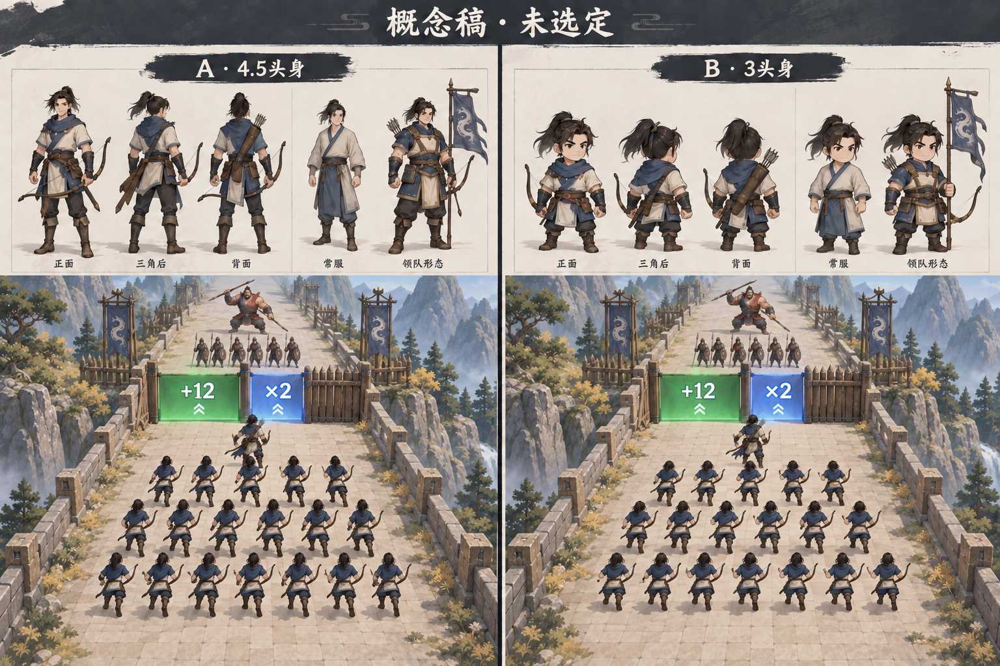
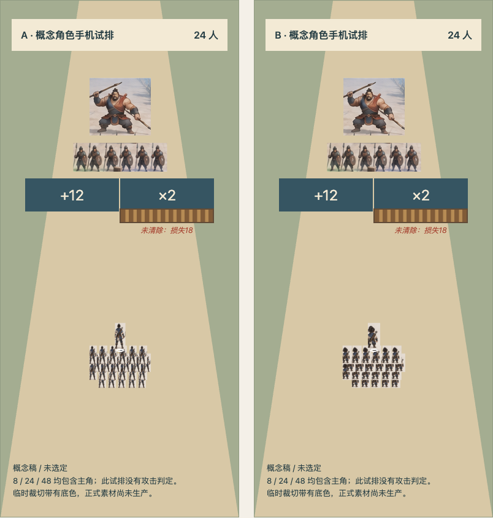
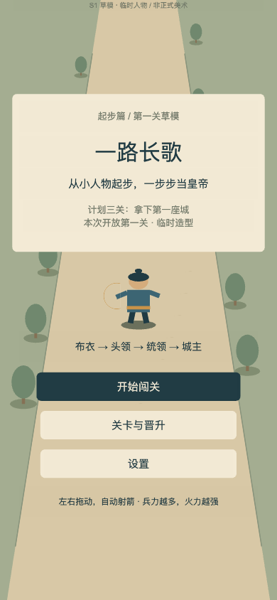
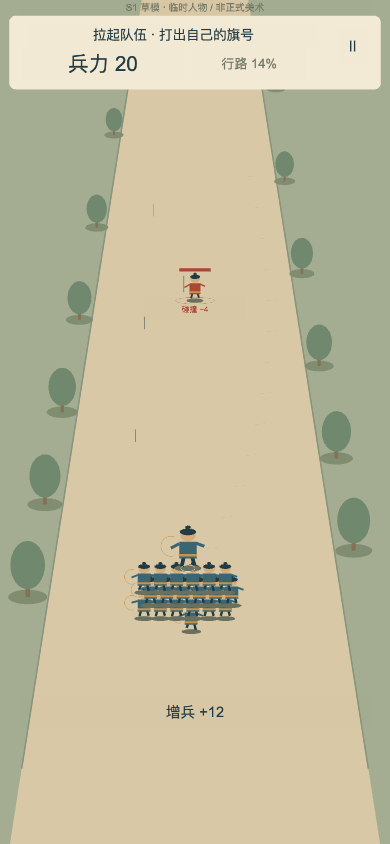
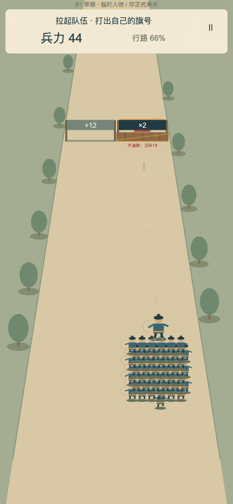
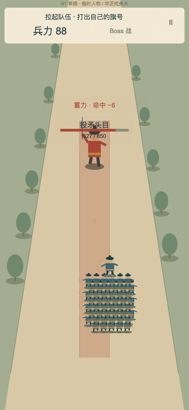
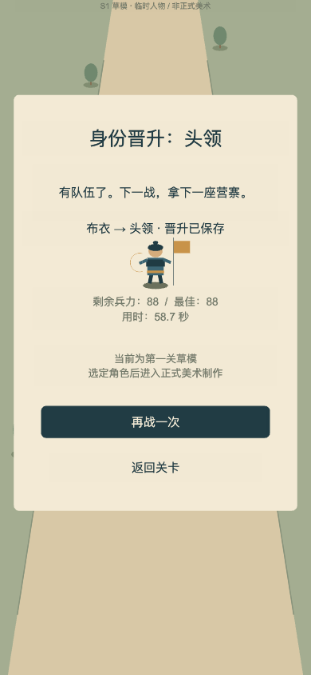
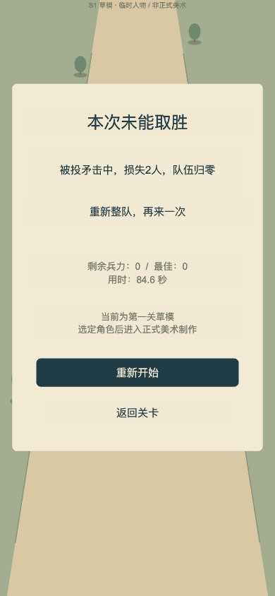

# 一路长歌 v0.2 · 给 GPT 的当前评审入口

这是 2026-09-20 按 `YILU_FIRST_THREE_V02.zip` 实施的 **S0/S1 首关草模**，用于决定下一步。不要将旧版三朝/纸兵/送信方案或旧版验收报告当成当前产品。

## 当前目标与真实完成范围

产品方向：左右拖动、自动射箭、数字门增兵、清障与躲避、击败Boss、逐关晋升。长期目标走向皇位；前三局只到第一座城，分别是「拉起队伍 → 拿下营寨 → 夺下首城」。本轮只开放第一关，A/B角色未选定、正式美术未生产。

第一关：8人出征，6秒左+12/右×2，18秒左×2/右+24，34秒左+12/右×2。第三排右侧木障HP80，未清除先扣18人，再翻倍；归零失败，不被增兵复活。42秒行路后投矛Boss，HP650，2秒观察，锁定落点后1.4秒预告，命中损失6人。

核心合同：真实兵力最高256，可见人数最多48且包含主角；箭按发射时人数与横向位置冻结伤害，近目标先命中；木障可毁、山石挡箭不可毁；门每排只结算一次。没有硬超时、金币、付费复活或身份隐藏攻击系数。

Cocos Creator 3.8.8、TypeScript，同工程构建浏览器与微信小游戏。旧存档原样保留，新键 `yilu-changge-prototype-v2` 仅迁移设置；进度按 `trial-01/02/03` 存储。第二/第三关完成配置与纯规则验证，尚未开放实机入口。

## 请先看这些画面

### A/B候选概念图（未批准、未接入运行）

A偏4.5头身、挺拔的国风动画战将；B偏3头身、轻松紧凑的小人物。生成图中的队伍数量和木障位置仍有偏差，不作为精确规则依据。下面的程序试排才具有准确人数与半侧门位置。

### 同场景24人手机试排（概念角色，非实机）

- [8人居中](phone-8-center.png)
- [48人居中](phone-48-center.png)
- [48人极左](phone-48-left.png) / [48人极右](phone-48-right.png)
- 同目录还包含24人、8人极左/极右图。

临时裁切带底色，不能当作已经制作透明角色资产。手机下A的细节更细、B轮廓更紧凑，但是否采用仍需用户选择。生成工具、提示词和素材状态见 [ART-STATUS.md](ART-STATUS.md) 与 [image-prompts.json](image-prompts.json)。

### 真实Cocos首关草模

下列画面是临时部件造型，验证操作和规则，不代表A/B任一正式美术已接入。

[360×800实际画面](../../evidence/v02/battle-360.png)

## 连续录屏

- [首页到第一次增兵：10秒 MP4](../../evidence/v02/first-ten-seconds.mp4) · [原文件](https://raw.githubusercontent.com/yvain57-afk/yilu-changge/main/evidence/v02/first-ten-seconds.mp4)
- [完整第一关：68秒 MP4](../../evidence/v02/first-level.mp4) · [原文件](https://raw.githubusercontent.com/yvain57-afk/yilu-changge/main/evidence/v02/first-level.mp4)

实际触摸输入，无跳时间、改兵力、改HP或强制获胜接口；视频排除冷启动、裁去录制框外空白，没有加速。录制器有效画面304×632，无音轨；手机布局以390×844与360×800原始截图为准。68秒片段包括首页停留、实机战斗与结算，游戏有效战斗时间58.67秒，两个数字不是同一计时口径。

`localhost`只在开发电脑可用，外部GPT不能通过它试玩。仓库提供的是源码、截图、录屏和证据；未部署公共在线游戏。若无法读取图片或视频，请明确可访问范围，不声称已看过或亲玩。

## 验证与未解决的问题

|项|已观察到的结果|
|---|---|
|新版规则回归|30项通过，失败/跳过/TODO均0；含规则十局、三关三类策略、真实失败路线|
|类型与故障检出|核心/Cocos类型检查通过；故意移除过门保护会触发正式断言失败|
|第一关真实触摸|58.67秒，88人通关并保存头领；页面错误0、外部运行请求0|
|浏览器边界|暂停/显式继续、真实hidden后台、触摸取消、坏档、写入失败、旧档隔离、两个视口重开|
|实际失败|84.62秒归零；最后只剩2人，正确显示“损失2人”而不是潜在6人|
|构建|Cocos浏览器和微信构建均原始退出36|
|微信验收|只有touristappid游客构建；专用AppID、开发者工具及真机验收未完成|
|美术与体验|A/B未选定；正式首关、用户手感验收、目标手机性能未完成|

最明显的后续数值问题：第二关“晚换路”策略仅剩16人，总时长约220.42秒，Boss约166.42秒。仍有合法可通路线，但远超正常节奏目标，不能用强制超时、暗改HP或假通过率掩盖。

首关纯规则对比：提前清障88人/59.17秒；安全门56人/68.67秒；晚换路52人/70.92秒。完整逐关数值、实际命令和边界见 [VERIFICATION.md](VERIFICATION.md)。这些不是人类玩家通过率，也不代替手感判断。

## 需要GPT输出什么

1. 按当前开发包检查S1是否漏了会阻碍下一阶段的内容，区分规则缺陷、草模可接受的临时表现、S2/S3才需完成的事项。
2. 实际看A/B多视图和390宽试排，比较主角辨识、弓手朝向、晋升是否同一个人、48人拥挤程度。给建议和依据，不替用户宣布选择。
3. 从模型、配置、渲染与测试核查公平性：受阻门半侧覆盖/一次事务、箭冻结伤害、真实预告范围、Boss锁定与恢复、存档隔离。发现问题请给文件及相关逻辑。
4. 给出下一阶段 **正式第一关S2** 的小范围任务单：先锁定角色，再补真实透明素材/动作、场景和反馈；不要直接批量生产三关正式美术。
5. 对第二关低兵力长战斗提出可验证的调参候选，列出需要重跑的路线。当前仅提出候选，不把未试玩数值写成最终方案。

用户选择造型是停点A；正式第一关亲玩确认是停点B。然后才能扩第二、第三关。不要恢复旧纸兵、修书/送信、三朝分关，也不要新增商业化、账号、联网服务或完整世界观。

## 阅读文件索引

- 需求：[开发设计书](package/CODEX_FIRST_THREE_BRIEF.md)、[美术说明](package/ART_DIRECTION.md)、[原始数值草案](package/LEVELS_V02_DRAFT.json)
- 迁移：[DECISIONS.md](DECISIONS.md)、[验证报告](VERIFICATION.md)
- 规则：[model.ts](../../assets/scripts/core/model.ts)、[levels.ts](../../assets/scripts/core/levels.ts)、[save.ts](../../assets/scripts/core/save.ts)
- 画面：[Game.ts](../../assets/scripts/Game.ts)、[BattleView.ts](../../assets/scripts/BattleView.ts)、[VisualConfig.ts](../../assets/scripts/VisualConfig.ts)、[Platform.ts](../../assets/scripts/Platform.ts)
- 验收：[rules.test.ts](../../tests/rules.test.ts)、[实测摘要](../../evidence/v02/summary.json)、[首关轨迹](../../evidence/v02/browser-first.json)、[失败轨迹](../../evidence/v02/browser-failure.json)、[后台证据](../../evidence/v02/browser-lifecycle.json)
- 原始命令：[规则日志](../../evidence/v02/rules.log)、[核心类型](../../evidence/v02/typecheck-core.log)、[Cocos类型](../../evidence/v02/typecheck.log)、[负向故障](../../evidence/v02/negative-gate.log)

旧版资料留存于原目录与Git历史，仅作为背景，不表示当前玩法或当前验收。
