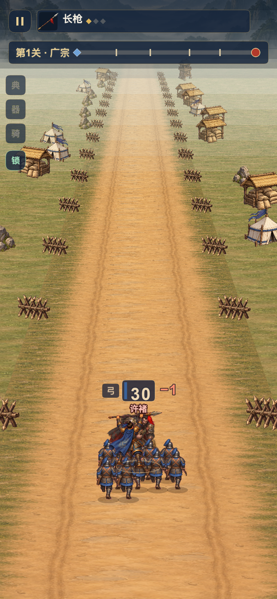
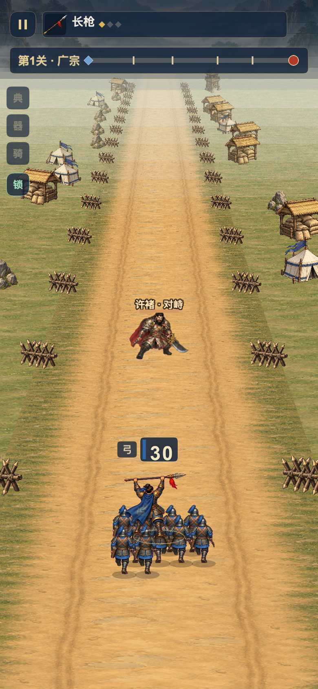
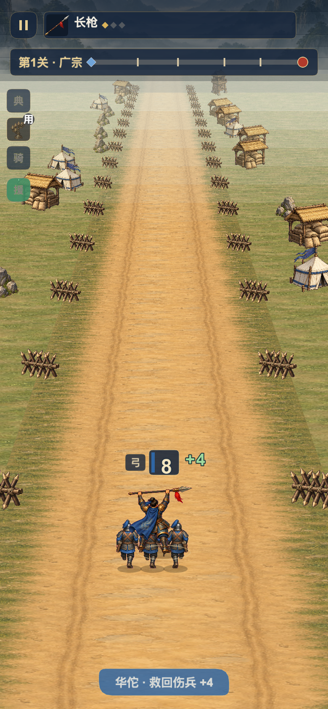
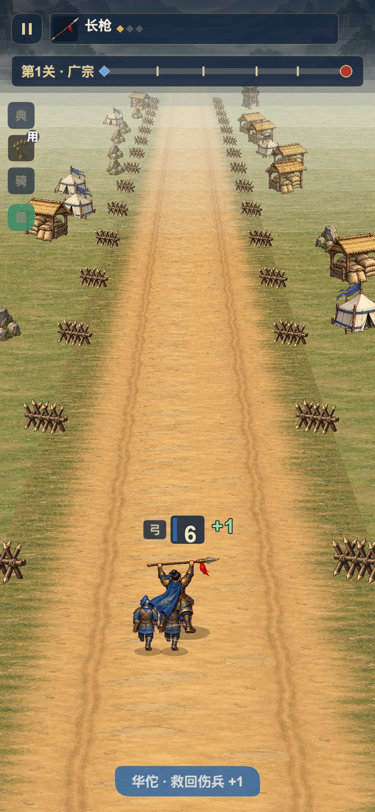
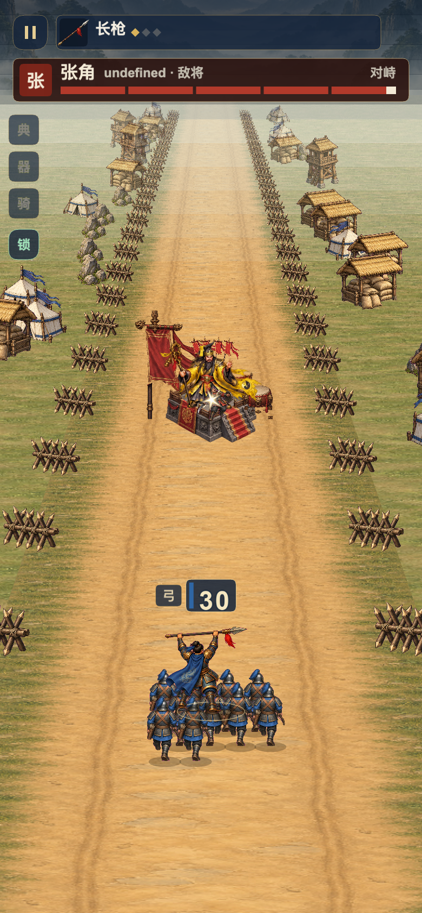
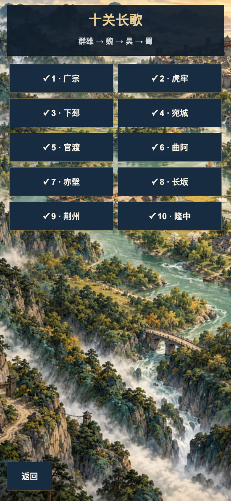
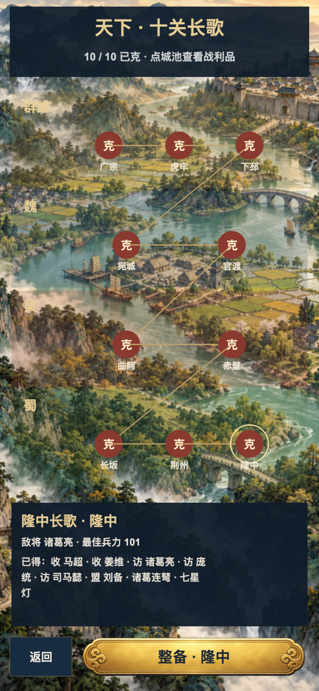

# 四组实际修前/修后

前三组是正式Cocos受控夹具；第四组是同一完成存档。均为实际截图，未用效果图代替。数值证据见before/after-regression.json。

## 途中名将接触

相同满18HP许褚、30兵、脚点距离0.2；旧版满血退场，新版进入交锋。

| 修前 | 修后 |
|---|---|
|  |  |

## 实际战损与治疗

相同2兵、−12门、七星灯、华佗；旧版最终9，新版6。

| 修前 | 修后 |
|---|---|
|  |  |

## 光波穿透预算

相同穿透1直波、16.8处敌兵和17处首领；旧版首领97，新版100。

| 修前 | 修后 |
|---|---|
|  |  |

## 区域地图

同一十关已完成测试存档、390×844视口；关卡列表改为区域节点与奖励抽屉。

| 修前 | 修后 |
|---|---|
|  |  |

